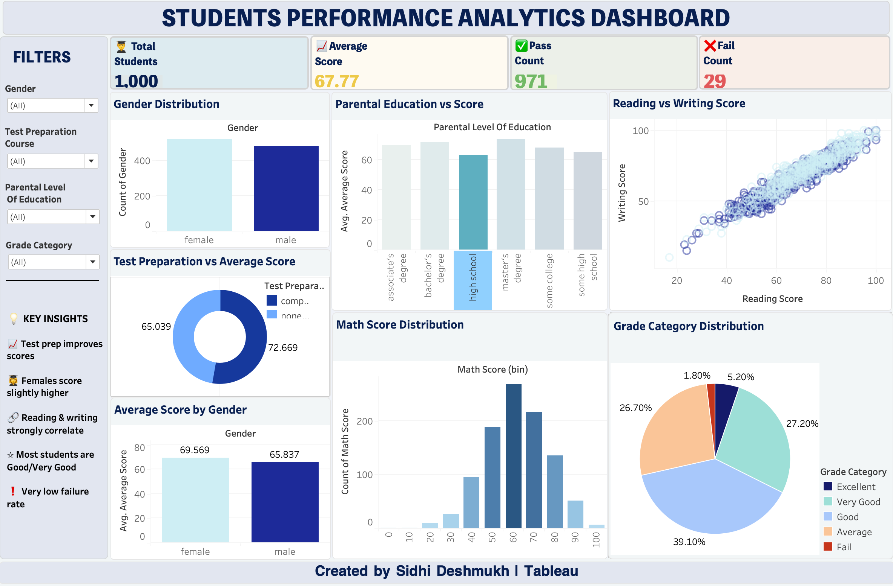

{\rtf1\ansi\ansicpg1252\cocoartf2822
\cocoatextscaling0\cocoaplatform0{\fonttbl\f0\fswiss\fcharset0 Helvetica;}
{\colortbl;\red255\green255\blue255;}
{\*\expandedcolortbl;;}
\paperw11900\paperh16840\margl1440\margr1440\vieww11520\viewh8400\viewkind0
\pard\tx720\tx1440\tx2160\tx2880\tx3600\tx4320\tx5040\tx5760\tx6480\tx7200\tx7920\tx8640\pardirnatural\partightenfactor0

\f0\fs24 \cf0 # Student Performance Analytics Dashboard\
\
## Project Overview\
This project analyzes student performance data to understand how gender, parental education, and test preparation affect student scores. The final dashboard was created in Tableau to present key insights clearly.\
\
## Tools Used\
- Python\
- Pandas\
- NumPy\
- Tableau\
- Excel/CSV\
\
## Dataset\
The dataset contains student performance details including:\
- Gender\
- Parental level of education\
- Test preparation course\
- Math score\
- Reading score\
- Writing score\
\
## Key KPIs\
- Total Students: 1000\
- Average Score: 67.77\
- Pass Count: 971\
- Fail Count: 29\
\
## Key Insights\
- Students who completed the test preparation course scored higher.\
- Reading and writing scores show a strong positive correlation.\
- Female students scored slightly higher on average.\
- Most students belong to Good and Very Good grade categories.\
- The overall failure rate is very low.\
\
## Dashboard Preview\
\
\
## Project Workflow\
1. Collected the student performance dataset.\
2. Cleaned the data using Python and Pandas.\
3. Created new columns such as average score, result, and grade category.\
4. Performed exploratory data analysis.\
5. Built an interactive Tableau dashboard.\
6. Generated insights from the dashboard.\
\
## Conclusion\
This dashboard helps understand student performance trends and highlights the impact of test preparation and demographic factors on academic scores.}